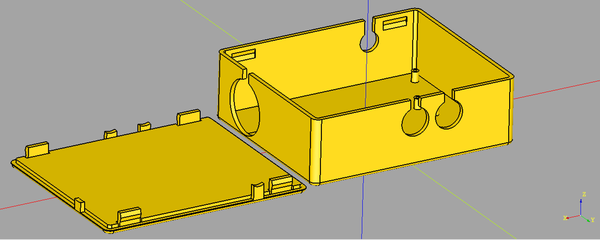

# Cad Query CAD
* [CadQuery project|https://github.com/CadQuery]
  
Scripts to parametrically generate parts

## Parametric enclosure

* Expanded parametric box based on Cad query example
* Parametric enclosure with slotted holes and posts
* Edit box dimensions at top
* Edit dictionary list to move holes and posts
* Run script in CadQuery editor. Export STLs by right click on CAD object in menu.

